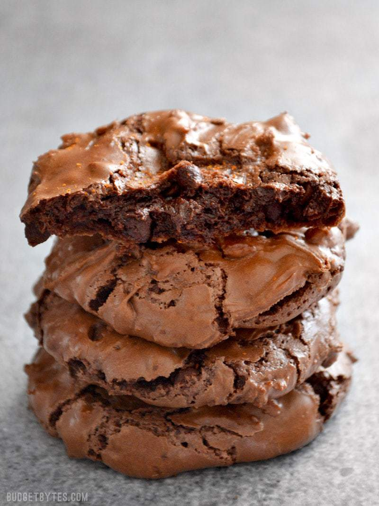
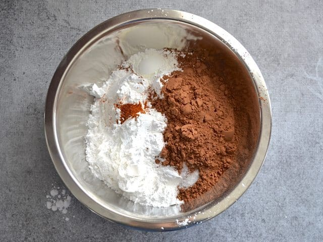
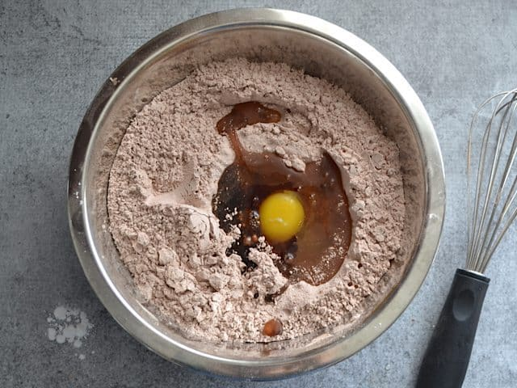
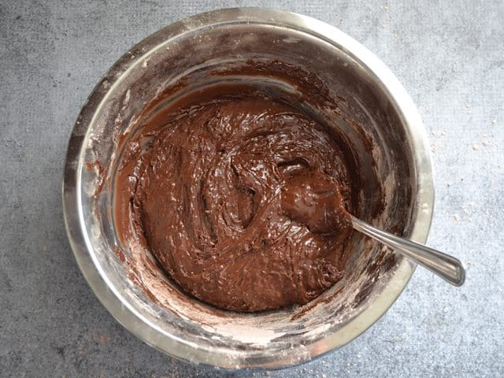
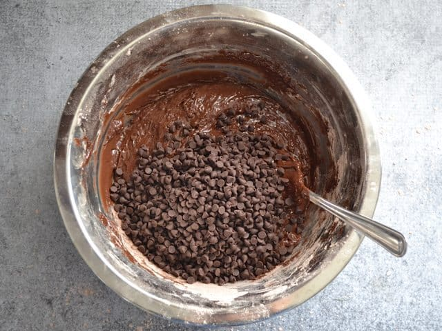
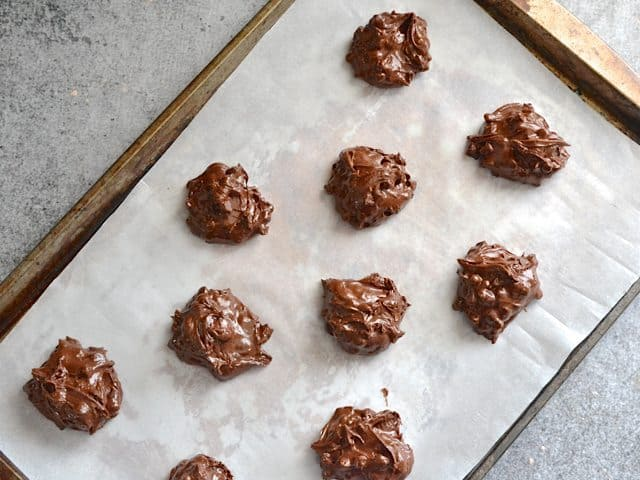
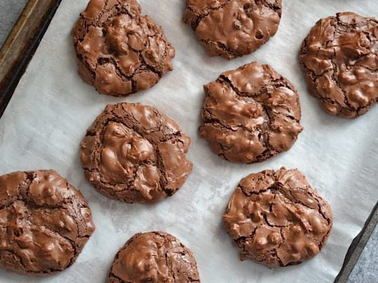
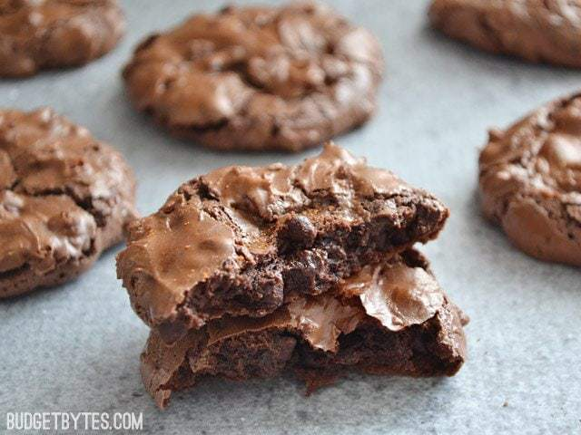

https://www.budgetbytes.com/chocolate-cayenne-crinkles/

Prep Time: 15 mins
Cook Time: 30 mins
Total Time: 45 mins

### INGREDIENTS

- 3 cups powdered sugar **($0.54)**
- 3/4 cup unsweetened cocoa powder **($0.48)**
- 1 Tbsp cornstarch **($0.04)**
- 1/4 tsp salt **($0.02)**
- 1/2 tsp cayenne pepper **($0.05)**
- 2 large egg whites **($0.42)**
- 1 large whole egg **($0.21)**
- 1 tsp vanilla extract **($0.28)**
- 1 cup chocolate chips **($0.91)**

### INSTRUCTIONS

- Preheat the oven to 350 degrees. In a large bowl, stir together the powdered sugar, cocoa powder, cornstarch, salt, and cayenne pepper until evenly combined.
- Add the egg whites, whole egg, and vanilla extract to the powdered sugar mixture. Carefully stir the mixture until all of the powdered sugar has dissolved into the eggs and a very thick batter forms. It may seem like there is not enough moisture to stir in all the powdered sugar, but keep stirring and it will eventually melt in. The mixture will be very thick and stiff, so use a strong spoon. Add the chocolate chips and stir until incorporated.
- Line two baking sheets with parchment paper. Spoon the batter, one heaping tablespoon at a time, onto the baking sheets. Be sure to leave a couple inches between each cookie because they will spread. (I suggest ten cookies per sheet.)
- Bake one cookie sheet at a time for 14 minutes or until the cookies are puffed and cracked over the surface. Allow the cookies to cool before removing from the parchment.

### NOTES

To make chocolate peppermint cookies, add one teaspoon peppermint extract to the batter and top with crushed candy canes.

## 

## 

##  STEP BY STEP PHOTOS

Preheat the oven to 350 degrees. In a LARGE bowl, combine 3 cups powdered sugar, 3/4 cups unsweetened cocoa powder, 1 Tbsp cornstarch, 1/4 tsp salt, and 1/2 tsp cayenne pepper. If you’re scared of the spiciness, start with 1/4 tsp cayenne. Make sure the dry ingredients are very well mixed. Hint: use a bowl with steep sides, or you’ll get powdered sugar everywhere.

Add two large egg whites, one whole egg, and 1 tsp vanilla extract. Begin to carefully stir these into the powdered sugar mixture. You can use a whisk at first, but it will soon get too thick and you’ll need to switch to a spoon.

As you stir the eggs and vanilla into the powdered sugar it will seem like there’s not enough moisture to make it work (I went back and checked the recipe THREE times to make sure…), but just keep stirring and eventually all of the powdered sugar will melt into it. The batter becomes very thick and stiff.

Stir in one cup of chocolate chips. I happened to have some leftover mini-chocolate chips, so I used those.

Cover two baking sheets with parchment paper. Drop the batter onto the sheets in heaping tablespoons, about ten per sheet. Leave a couple inches between each cookie for them to spread while baking.

Bake one sheet at a time for 14 minutes, or until the cookies are puffed up and cracked along the top (they deflate upon cooling). Let the cookies cool completely before removing them from the parchment.

Enjoy the warm chocolatey goodness and the sassy kick of cayenne!