https://www.budgetbytes.com/homemade-chocolate-crescent-rolls/

*You can freeze these and then bake them whenever!*

Prep Time: 1 hr 30 mins
Cook Time: 22 mins
Total Time: 1 hr 52 mins

### INGREDIENTS

- 1 cup all-purpose flour **($0.12)**
- 8 Tbsp cold butter (salted) **($1.07)**
- 1/8 tsp salt **($0.02)**
- 1/4 cup ice water **($0.00)**
- 1/2 cup chocolate chips **($0.67)**
- 1 large egg **($0.27)**

### INSTRUCTIONS

- Add the flour and salt to to a bowl or food processor. Cut the butter into 1 tablespoon chunks, and add it to the flour and salt. Pulse the food processor or use a [pastry cutter](https://www.amazon.com/Winco-Blade-Pastry-Blender-Stainless/dp/B003HEWB08/ref=sr_1_5?s=kitchen&ie=UTF8&qid=1486497421&sr=1-5&keywords=pastry+cutter&tag=budgetbytes0d-20) to work the butter into the flour until the butter is in pieces the size of peas. Add just enough water to form a cohesive ball of dough, with no dry flour left on the bottom of the bowl (about 1/4 cup).
- Turn the dough out onto a floured surface and shape it into a rectangle. Roll the dough out until it is about twice it's original size, then fold it into thirds like a letter. Give the dough a quarter turn and roll it out once again. Repeat the rolling, folding, and turning sequence 5-6 times to create layers in the dough, making sure to flour the work surface as you go so the dough doesn't stick. After the final fold, wrap the dough in plastic and refrigerate for at least one hour or up to one day.
- After the dough has rested in the refrigerator, begin to preheat the oven to 400ºF. Roll the dough out to a rectangle, approximately 16x6 inches. Cut the rolled dough into three equal pieces horizontally, then cut each rectangle diagonally into two triangles. Place a few chocolate chips in the wide end of each triangle. Roll the triangles up, beginning with the wide end, and ending with the point. Bend each roll slightly into a crescent shape.
- Place the crescent rolls on a baking sheet lined with parchment paper. In a small bowl, whisk together one egg with 1 Tbsp water. Brush the egg wash over each crescent roll. Bake the crescent rolls for 20-22 minutes, or until they're deep golden brown and slightly puffed. Serve warm.

## STEP BY STEP PHOTOS

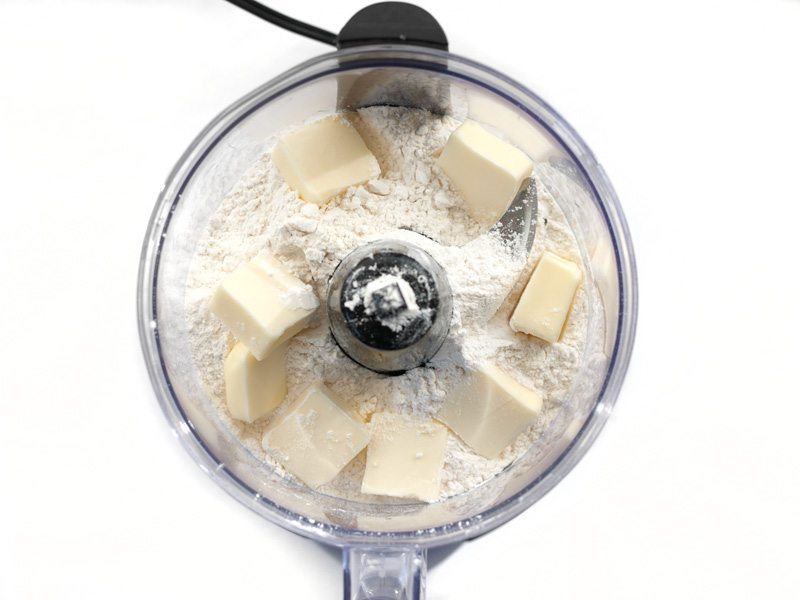

Start by adding 1 cup all-purpose flour, 1/8 tsp salt, and 8 Tbsp cold butter to a bowl or food processor. Make sure the butter is cold and cut into chunks (about 1 Tbsp each).

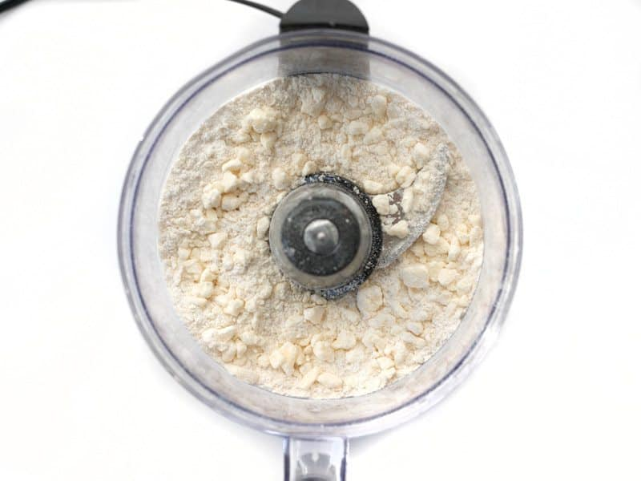

Pulse the mixture in the food processor, or use a pastry cutter to work the butter into the dough until it is in pea-sized chunks. You want slightly larger chunks of butter for this dough because it helps make a really flaky pastry and helps it puff up. 

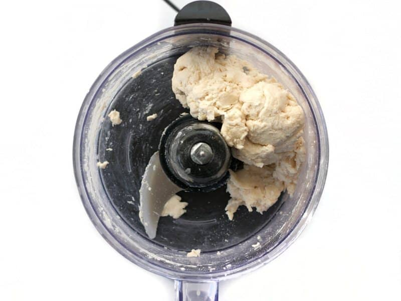

Pulse the mixture (or stir) while pouring in about 1/4 cup ice cold water to form a dough. You may need slightly more or less water to make your dough form a cohesive piece of dough. This can vary depending on the moisture content of your flour and water content of the butter. 

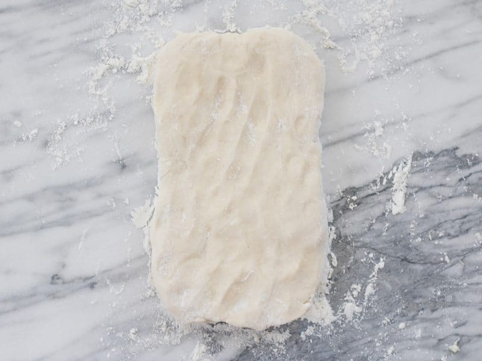

Turn the dough out onto a floured surface and shape it into a rectangle with your hands.

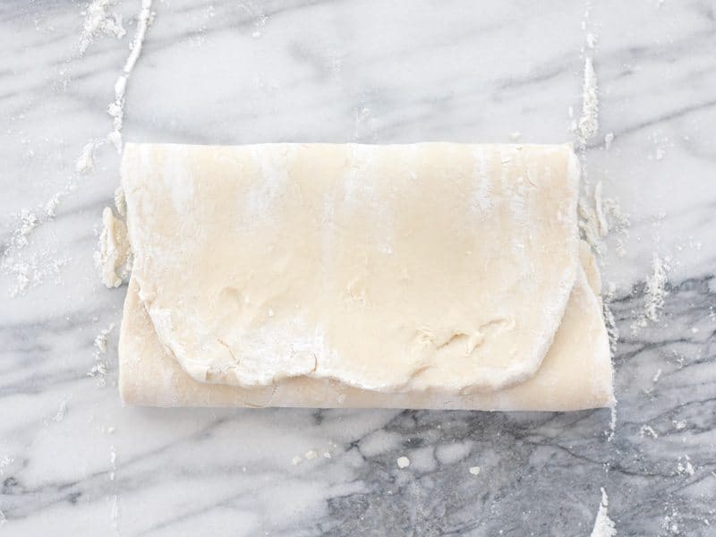

Roll the dough out until it’s about twice its size, then fold it over in thirds, like a letter.

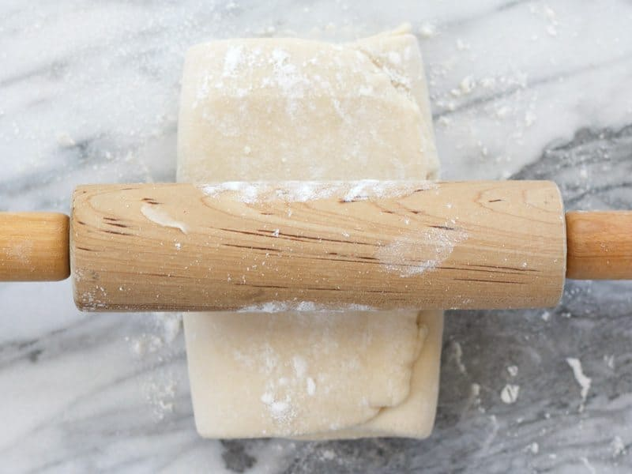

Give the dough a quarter turn, then roll it out again. Repeat this roll, fold, turn process 5-6 times to create several thin layers in the dough. Make sure to dust the work surface often, but lightly, to prevent the dough from sticking.

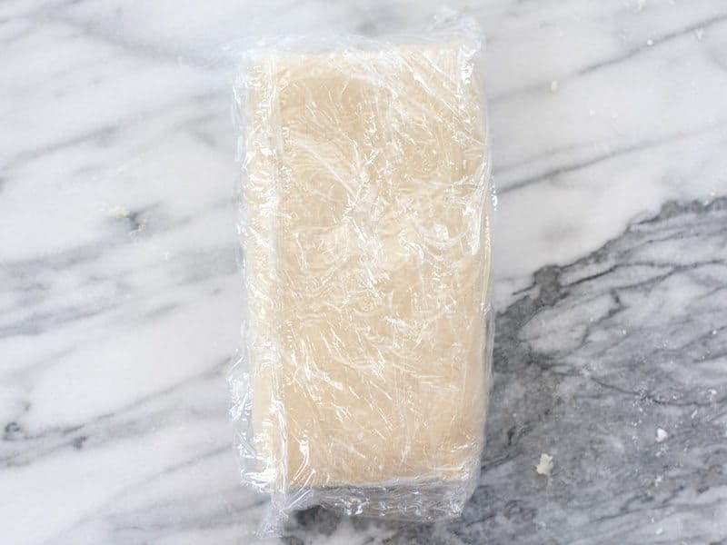

After the final fold, wrap the dough in plastic and refrigerate for 1 hour or up to one day.

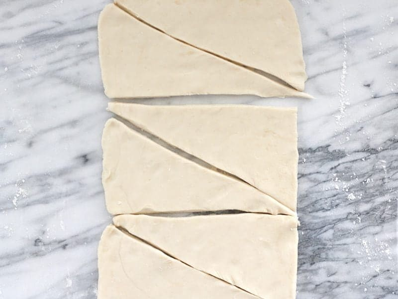

After the dough has rested in the refrigerator, begin to preheat the oven to 400ºF. Roll the dough out to a rectangle, about 16×6 inches. Cut the rectangle into three equal pieces, horizontally, then cut each of the smaller rectangles diagonally into two triangles.

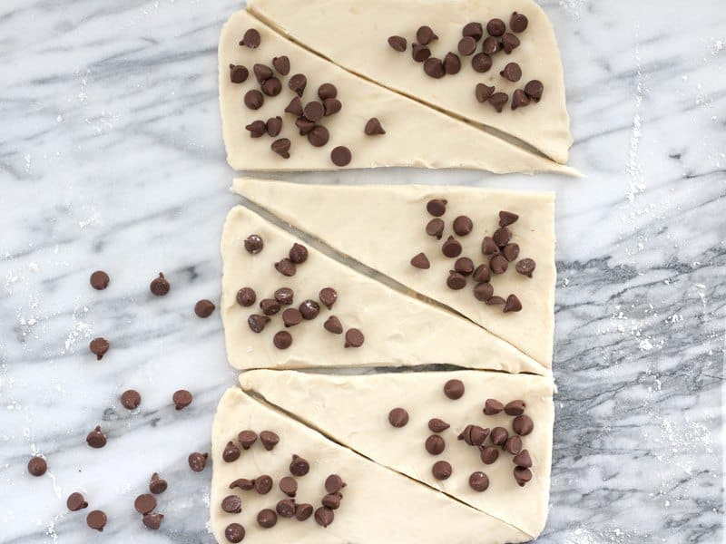

Place a few chocolate chips on the wide end of each triangle.

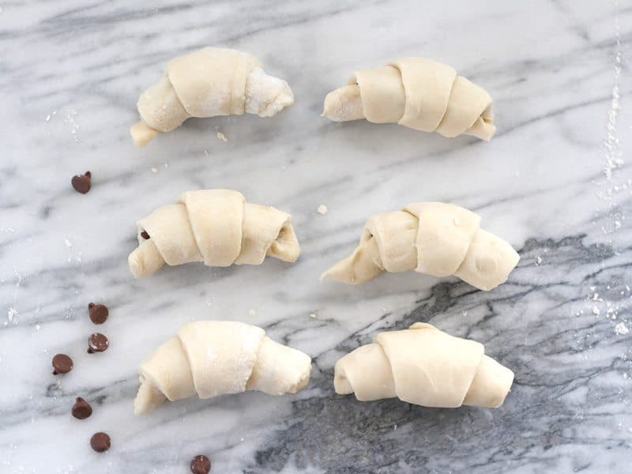

Roll each triangle up, starting with the wide end and ending with the point. Gently bend each roll into a slight crescent shape.

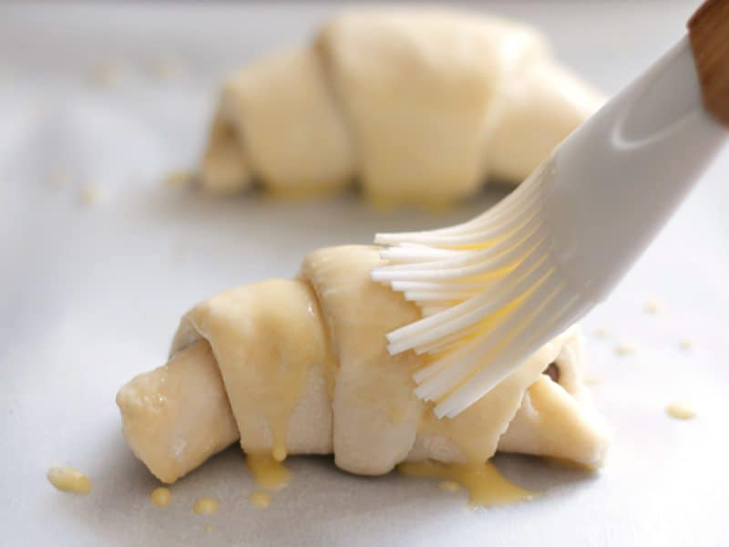

In a small bowl, whisk together a large egg with 1 Tbsp water. Brush the egg wash over each crescent roll. You can freeze all or some of the rolls at this point.

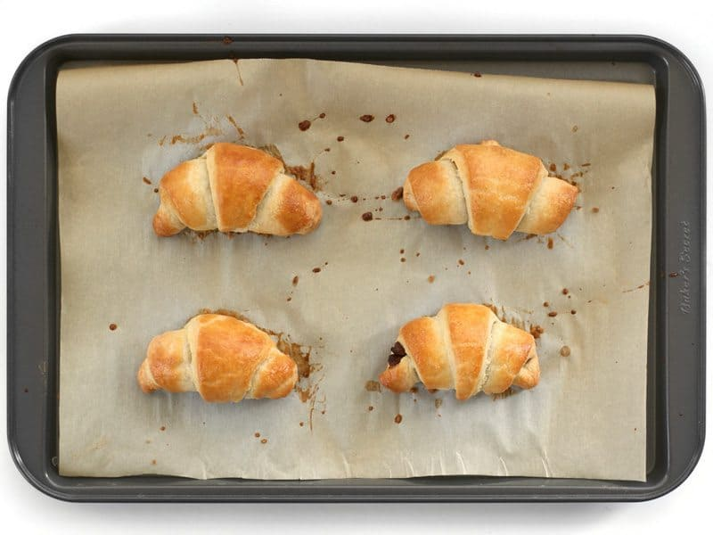

Place the rolls that you wish to bake on a baking sheet lined with parchment. Bake for 20-22 minutes, or until they’re deep golden brown and puffed up. Serve warm (preferably with coffee)!

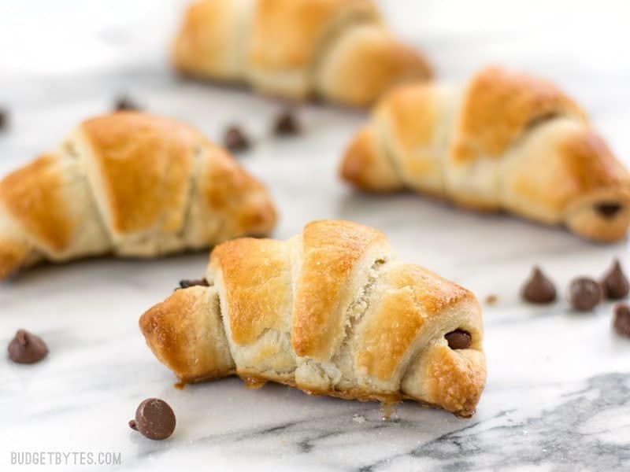

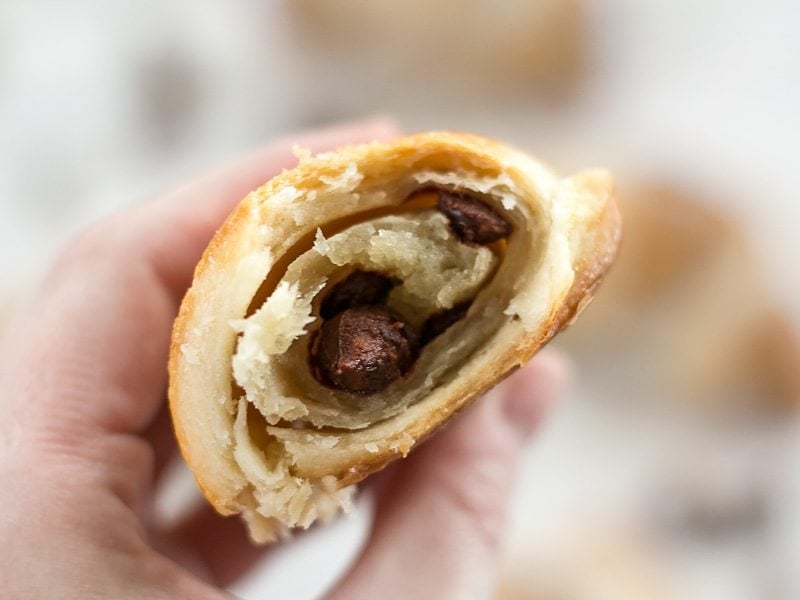