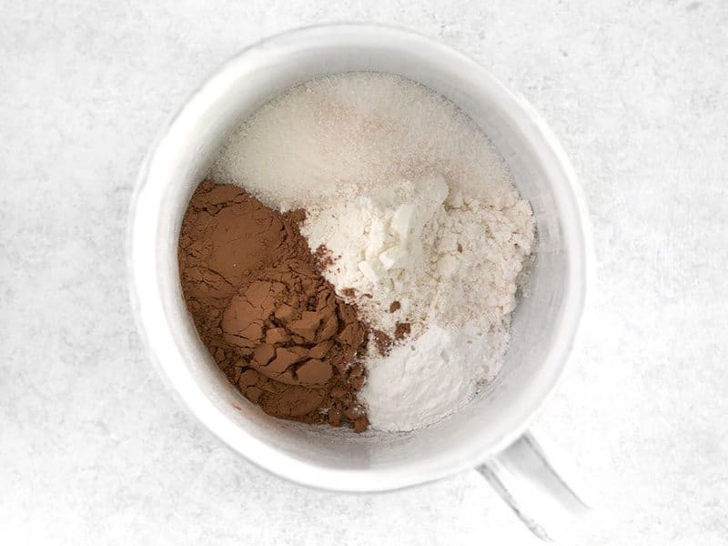
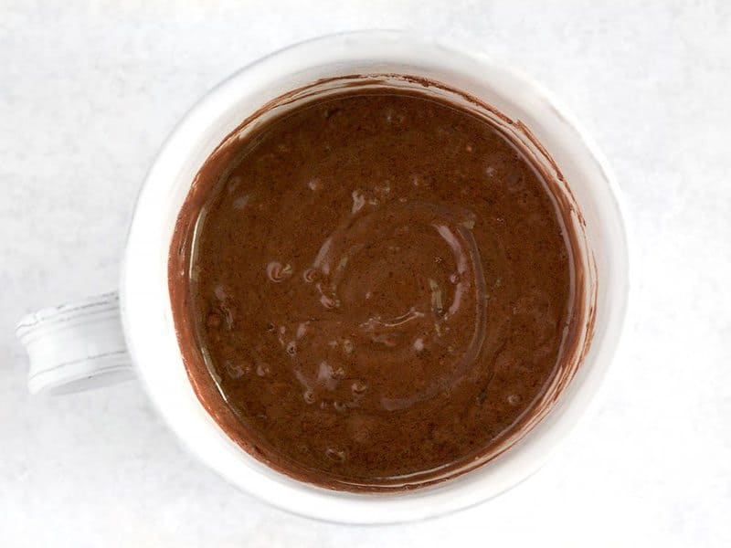
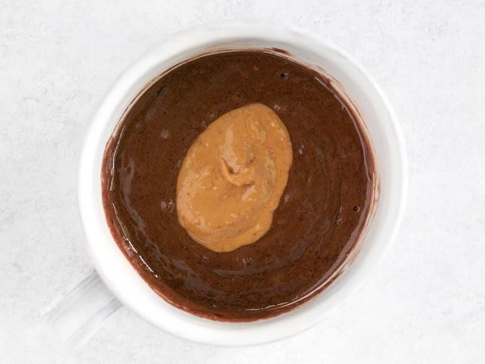
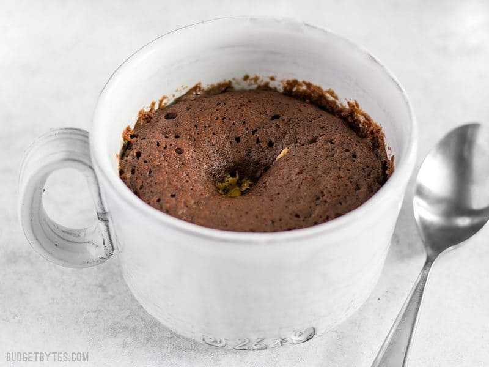
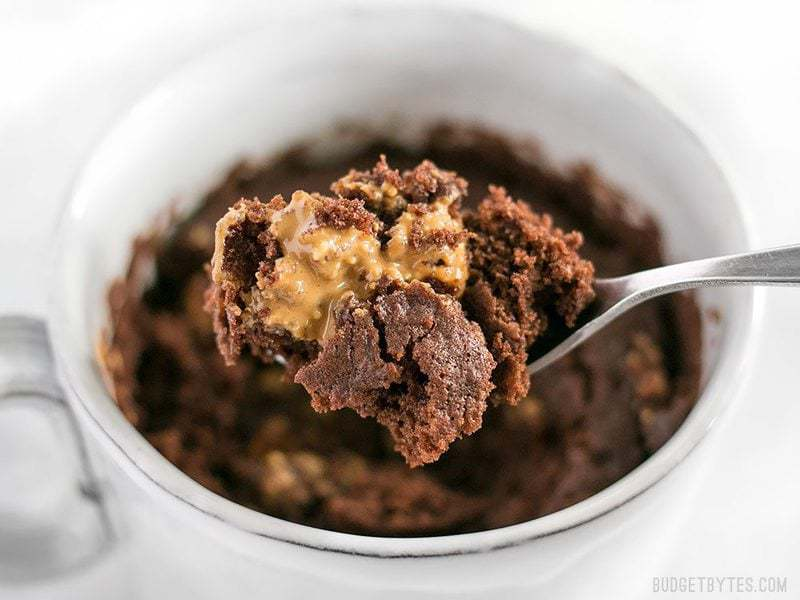
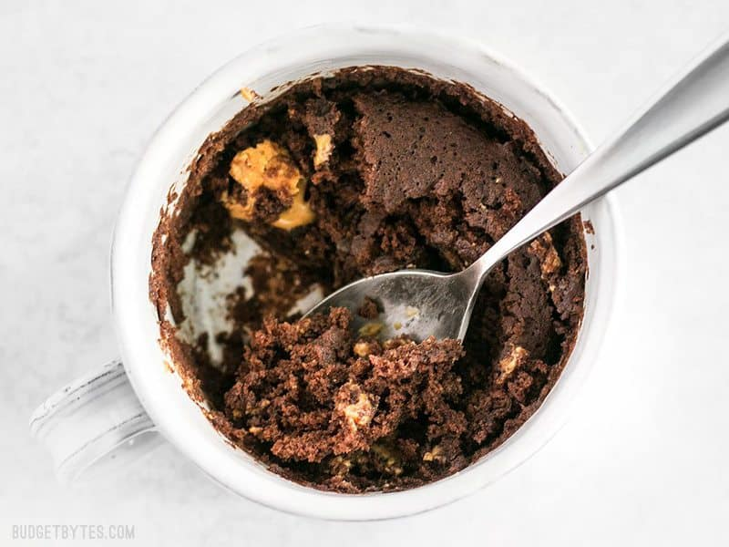

https://www.budgetbytes.com/the-one-chocolate-mug-cake/

Prep Time: 3 mins
Cook Time: 1 min
Total Time: 4 mins

### INGREDIENTS

- 2 Tbsp all-purpose flour **($0.02)**
- 1 Tbsp unsweetened cocoa powder **($0.03)**
- 2 tsp sugar **($0.01)**
- 1/4 tsp baking powder **($0.02)**
- a pinch salt **($0.01)**
- 1 Tbsp vegetable oil **($0.04)**
- 2 Tbsp milk **($0.04)**
- 1 Tbsp peanut butter **($0.13)**

### INSTRUCTIONS

- In your mug, stir together the dry ingredients (flour, cocoa powder, sugar, baking powder, and a pinch of salt). Make sure there are no clumps.
- Stir in the vegetable oil and milk until the mixture is smooth. Drop a tablespoon of peanut butter into the center and push it down into the batter.
- Microwave on high for one minute and then enjoy!

## STEP BY STEP PHOTOS

Add 2 Tbsp flour, 1 Tbs unsweetened cocoa powder, 2 tsp sugar, 1/4 tsp baking powder, and a pinch of salt to a microwave safe mug. Stir them together very well.

Add 2 Tbsp milk and 1 Tbsp oil, then stir until it forms a batter.

Drop a dollop of peanut butter (about 1 Tbsp) down into the center of the batter.

Microwave on high for one minute and you’ve got yourself a cake with a melty, peanut butter center! The cake turns out extra light and fluffy and the peanut butter kind of sinks in as the cake rises up around it. So magical!

Every bite has the light cake and a gooey, rich bit of melty peanut butter. Absolutely perfect.

And then five or six delightful bites later, you’re done and you don’t feel like you do when you “accidentally” eat a whole pint of ice cream. …not that that ever happens. 👀