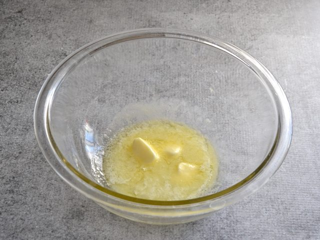
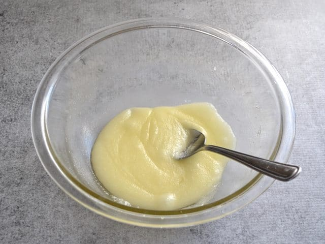
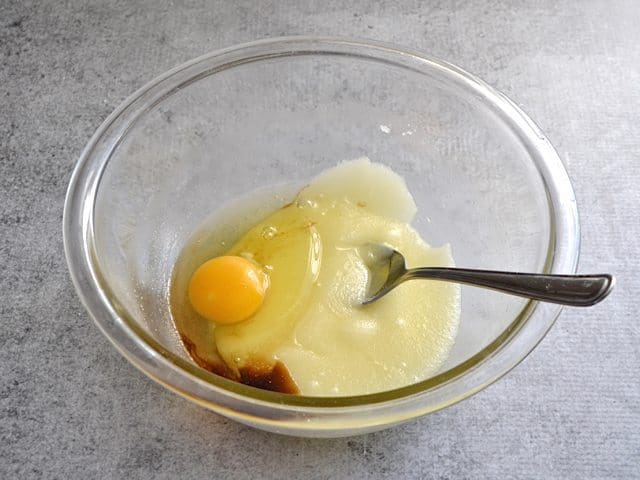
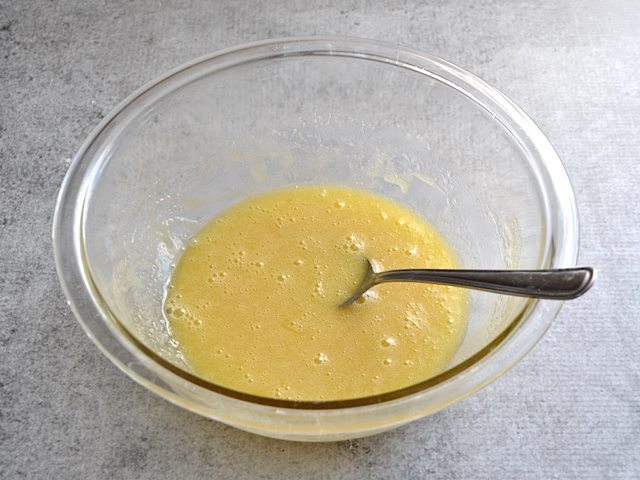
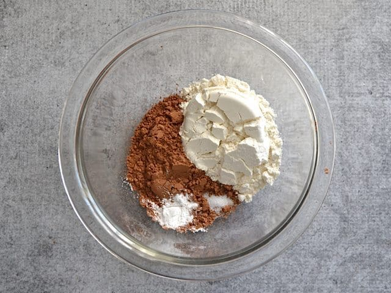
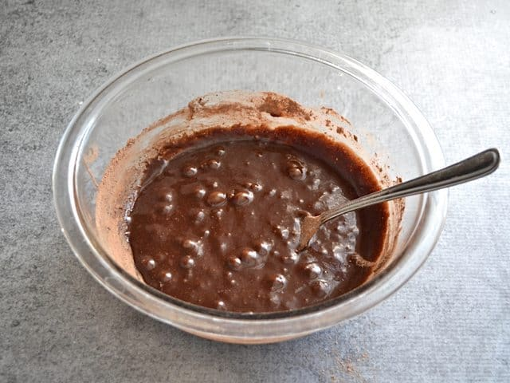
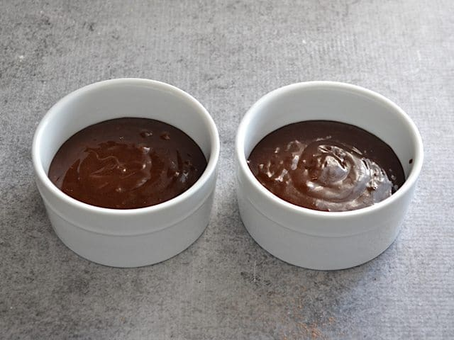
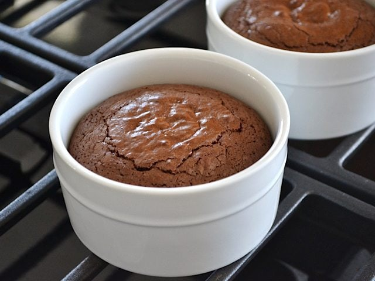
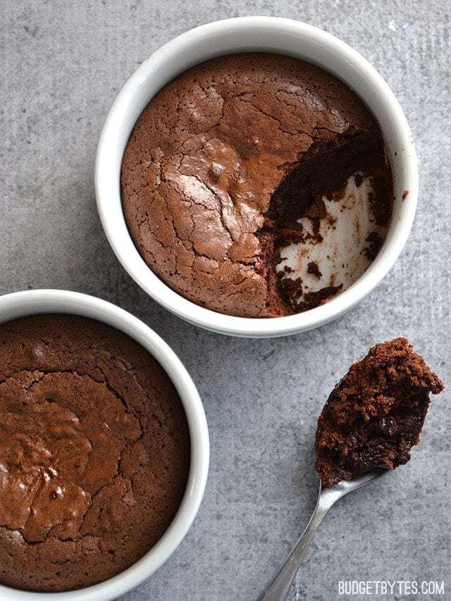
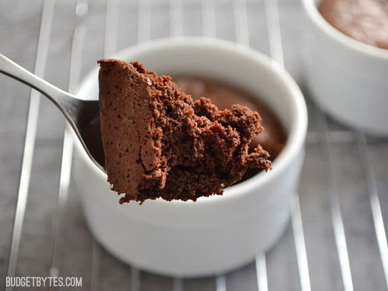

https://www.budgetbytes.com/fudge-brownie-pots-for-two/

Prep Time: 15 mins
Cook Time: 30 mins
Total Time: 45 mins

### INGREDIENTS

- 4 Tbsp butter **($0.40)**
- 1/2 cup granulated sugar **($0.08)**
- 1/4 tsp vanilla **($0.07)**
- 1 large egg **($0.19)**
- 1/3 cup all-purpose flour **($0.05)**
- 1/3 cup unsweetened cocoa powder **($0.21)**
- 1/4 tsp baking powder **($0.02)**
- 1/8 tsp salt **($0.02)**

### INSTRUCTIONS

- Preheat the oven to 350 degrees.Cut the butter into chunks and place it in a large microwave safe bowl. Microwave on high for 30 seconds, then stir until the butter is fully melted. Add the sugar and microwave for 15 seconds. Stir again, then repeat the 15 second intervals until the sugar and butter no longer separate from each other after being stirred (about 30-45 seconds total).
- Add the vanilla extract and egg to the melted butter and sugar, then stir to combine.
- In a separate bowl, stir together the flour, cocoa powder, baking powder, and salt until well combined.
- Pour the bowl of dry ingredients into the bowl of wet ingredients and stir just until a smooth, chocolatey batter has formed. Pour the batter into two 8oz. ramekins.
- Bake the brownies in the preheated 350 degree oven for 25-30 minutes, or until the center of each brownie has risen up into a dome and the surface looks glossy and cracked. Let the brownies cool slightly before eating.

## FUDGE BROWNIE POTS (FOR TWO)

 

## STEP BY STEP PHOTOS

Start by preheating the oven to 350 degrees. Melt 4 Tbsp of butter in a microwave safe bowl. I usually microwave on high, then stir until the butter finishes melting. This and the next step can be done on the stove over low heat, if desired.

Add 1/2 cup sugar to the melted butter, microwave for 15 seconds, then stir again. Repeat the 15 second intervals until the sugar no longer separates out from the melted butter after stirring. This should only require 30-45 seconds total. (When you first add it, the sugar will look very granulated and the oil from the butter will seep out. After heating it a bit more, the sugar melts a bit and the two incorporate into a mostly smooth mixture. It may still looks every so slightly granular.)

Add 1/4 tsp vanilla extract and one large egg.

Stir those in until the mixture is smooth.

To a separate bowl, add 1/3 cup all-purpose flour, 1/3 cup unsweetened cocoa powder, 1/4 tsp baking powder, and 1/8 tsp salt. Stir until they are very well combined and no clumps remain.

Pour the bowl of dry ingredients into the bowl of wet ingredients and stir until everything is combined and a smooth, chocolatey batter has formed.

Pour the batter into two 8oz. ramekins.

Bake the brownies for 25-30 minutes, or until the centers have risen up into a dome and the surface looks glossy and cracked. Mine could have gone for a minute or two longer because the center deflated a bit upon cooling, but I was okay with that because it just meant that the center was extra fudgey. Yessssss.

Let the fudge brownie pots cool for a minute so you don’t burn your tongue off, then DIG IN.

A little fudgey, a little cakey, a LOT of delicious.