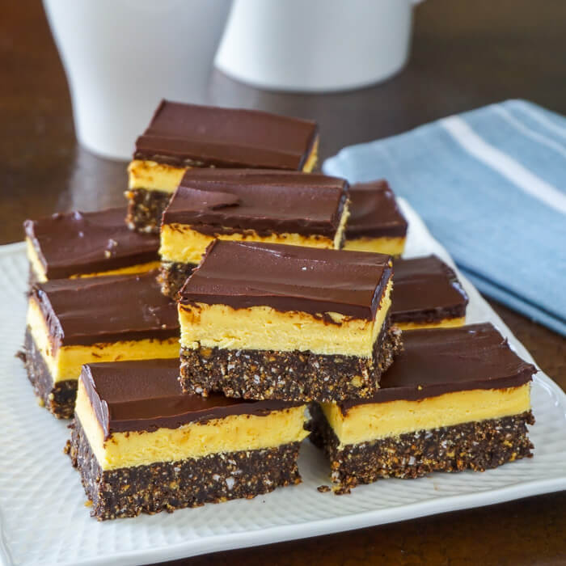

## Nanaimo Bar Recipe

### Bottom Layer

- ½ cup unsalted butter (European style cultured)
- ¼ cup sugar
- 5 tbsp. cocoa
- 1 egg beaten
- 1¾ cups graham wafer crumbs
- ½ c. finely chopped almonds
- 1 cup coconut

Melt first 3 ingredients in top of double boiler. Add egg and stir to cook
and thicken. Remove from heat. Stir in crumbs, coconut, and nuts.
Press firmly into an ungreased 8" x 8" pan.

### Second Layer

- ½ cup unsalted butter
- 2 Tbsp. and 2 Tsp. cream
- 2 Tbsp. vanilla custard powder
- 2 cups icing sugar

Cream butter, cream, custard powder, and icing sugar together well.
Beat until light. Spread over bottom layer.

### Third Layer

- 4 squares semi-sweet chocolate (1 oz. each)
- 2 Tbsp. unsalted butter

Melt chocolate and butter over low heat. Cool. Once cool, but still
liquid, pour over second layer and chill in refrigerator.