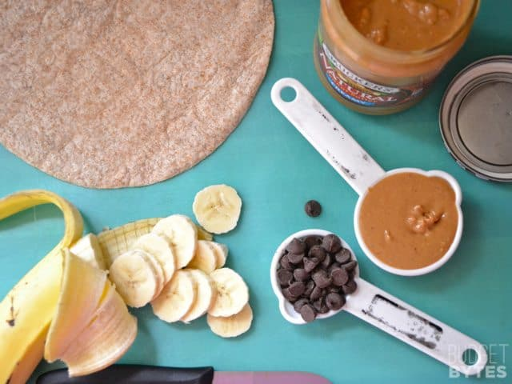
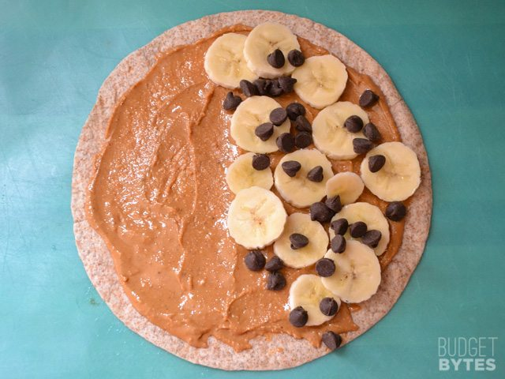
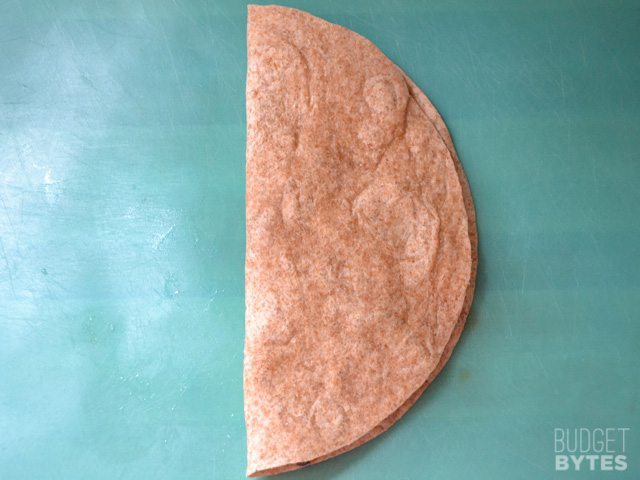
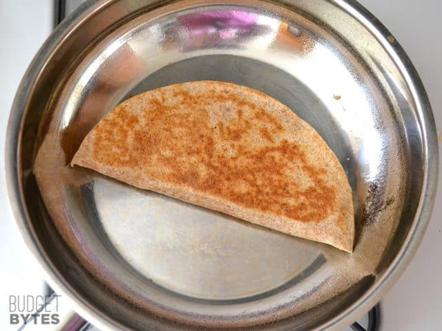
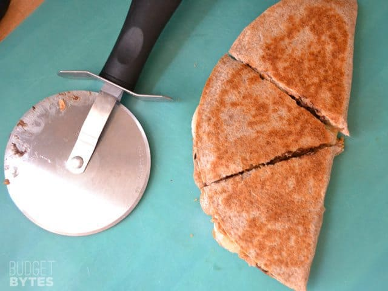
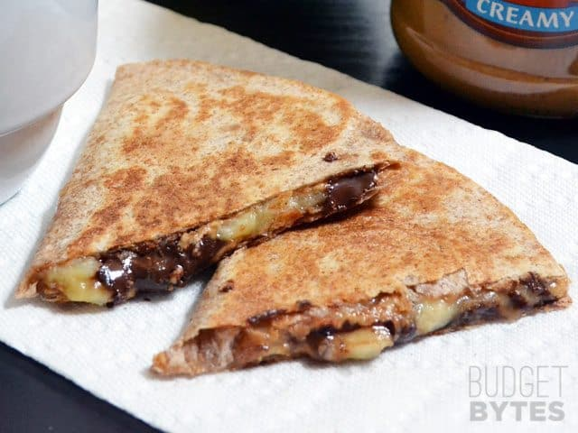

https://www.budgetbytes.com/peanut-butter-banana-quesadillas/

Prep Time: 5 mins
Cook Time: 5 mins
Total Time: 10 mins

### INGREDIENTS

- 1 8-inch whole wheat tortilla
- 2 Tbsp natural peanut butter
- 1/2 medium banana
- 1 Tbsp semi-sweet chocolate chips

### INSTRUCTIONS

- Spread the peanut butter over the surface of the tortilla.
- Slice the banana very thinly and then arrange the slices over half of the tortilla. Sprinkle the chocolate chips over the banana slices and then fold the tortilla in half.
- Cook the quesadilla in a skillet over medium-low heat until golden brown and crispy on both sides.

## STEP BY STEP PHOTOS

This is all you need. Most of these things might already be in your pantry. I thought I was going to need 1/4 cup of peanut butter and 2 tablespoons of chocolate chips, but ended up using only half that amount of each and it was plenty.

 

Spread the peanut butter over the surface of the tortilla (yes, that’s only 2 tablespoons of PB!). I find that natural peanut butter spreads easier and tastes more peanut-y. Slice the banana very thin. This is important or else the quesadilla won’t hold together as well and the bananas won’t get so gooey. Arrange the slices over half of the tortilla and then sprinkle the chocolate chips on top.

 

Fold the empty side over the filled side.

 

Cook the quesadilla in a skillet over medium-low heat until it is golden brown and crispy on both sides. If you are using a non-stick skillet, you probably won’t need any non-stick spray. Cooking over medium-low heat gives the insides time to warm up and get gooey before the outside gets overly browned.

 

I like to use a pizza cutter to slice my quesadilla. If you cut from the outside edge in towards the center (the folded edges), less of the filling will squeeze out in the process.

 

Yes, yes, yes.